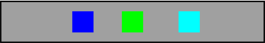
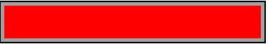
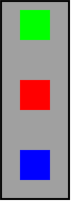

# NSLayoutConstraint + KeyPath

A very lightweight DSL for autolayout for your swift applications, exposed as a set of extension.
Just copy and paste the contents of this file as NSLayoutConstraint+KeyPath.swift


## Examples

**Position adjacent siblings**


```swift
let centeredBox = box(.green)
let leftBox = box(.blue)
let rightBox = box(.cyan)

container.addSubview(centeredBox)
container.addSubview(leftBox)
container.addSubview(rightBox)

NSLayoutConstraint.activating([
	leftBox.relativeTo(centeredBox, positioned: .toLeft(spacing: 40) + .equallySized() + .centerY()),
	centeredBox.relativeTo(container, positioned: .centered),
	rightBox.relativeTo(centeredBox, positioned: .toRight(spacing: 50) + .equallySized() + .centerY()),
	centeredBox.constrainedBy(.height(30) + .aspectRatio(1.0))
])
```

**Insetting**


```swift
let b1 = box(.red)
container.addSubview(b1)

NSLayoutConstraint.activating([
	b1.relativeTo(container, positioned: .inset(by: 7.0)),
])
```

**Easy reuse**



```swift
        let b1 = box(.green)
        let b2 = box(.red)
        let b3 = box(.blue)

        container.addSubview(b1)
        container.addSubview(b2)
        container.addSubview(b3)

        let equallySizedUnder = .equallySized() + .centerX() + .below(spacing: 40)

        NSLayoutConstraint.activating([
            b1.relativeTo(container, positioned: [
                equal(\.centerXAnchor),
                equal(\.topAnchor, constant: 10)
            ]),
            b1.constrainedBy(.height(30) + .aspectRatio(1.0)),
            b2.relativeTo(b1, positioned: equallySizedUnder),
            b3.relativeTo(b2, positioned: equallySizedUnder)
        ])
```
